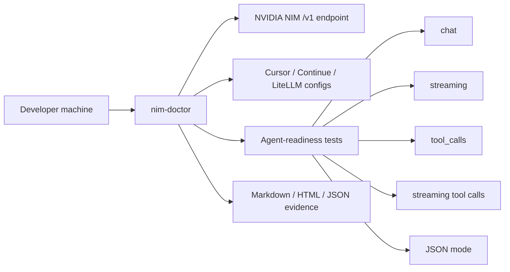
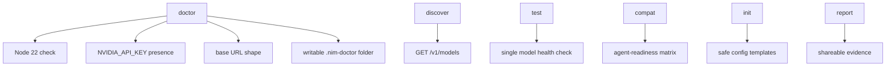
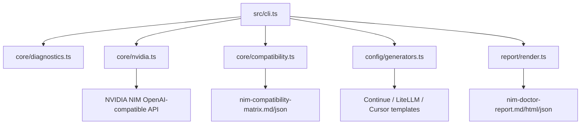

# nim-doctor

> Unofficial local-first diagnostic CLI for NVIDIA NIM developer workflows.

[](https://github.com/Gowrav-M/nim-doctor/actions/workflows/ci.yml)
[](LICENSE)
[](package.json)

NVIDIA NIM gives developers OpenAI-compatible model endpoints. The hard part is knowing whether a specific model actually works inside Cursor, Continue, LiteLLM, CrewAI, LlamaIndex, OpenCode, and other agent tools.

`nim-doctor` is the local preflight check before you trust NVIDIA NIM inside an agent workflow.

```bash
npx nim-doctor demo
```

The demo is offline. It writes local reports without needing an API key.

## Visual Map



## The Problem

Simple API checks are not enough.

| Looks fine | What can still break |
| --- | --- |
| API key exists | key is pasted into config or wrong env var is used |
| `/v1/models` works | selected model fails in `/chat/completions` |
| chat returns text | streaming hangs in an IDE |
| tool schema is accepted | response does not contain `message.tool_calls` |
| JSON mode is accepted | returned content is not parseable JSON |
| web UI works | local Cursor/Continue config is wrong |

## What nim-doctor Does



## Quick Start

```bash
# Offline proof, no key needed
npx nim-doctor demo

# Local setup checks
npx nim-doctor doctor

# Live model discovery, requires NVIDIA_API_KEY
npx nim-doctor discover

# Single model probe
npx nim-doctor test qwen/qwen3-coder-480b-a35b-instruct --stream --tools

# Full agent-readiness matrix
npx nim-doctor compat qwen/qwen3-coder-480b-a35b-instruct

# Generate reviewable tool config
npx nim-doctor init continue

# Scan existing config
npx nim-doctor check cursor

# Render evidence reports
npx nim-doctor report
```

PowerShell:

```powershell
$env:NVIDIA_API_KEY="nvapi-..."
cmd /c npx -y nim-doctor compat qwen/qwen3-coder-480b-a35b-instruct
```

## Agent-Readiness Matrix

`nim-doctor compat <model>` checks the paths that matter for coding agents.

```text
nim compatibility
-----------------
Decision: REVIEW | Agent readiness: 80/100
[PASS] chat: Capability returned the expected agent-compatible response shape.
[PASS] streaming: Capability returned the expected agent-compatible response shape.
[PASS] tools: Capability returned the expected agent-compatible response shape.
[FAIL] streaming_tools: streaming tool request did not return recognizable tool-call deltas.
[PASS] json_mode: Capability returned the expected agent-compatible response shape.
```

## Architecture



## Commands

| Command | Purpose |
| --- | --- |
| `demo` | Offline proof run with fixture models, generated configs, and reports |
| `doctor` | Checks Node version, API key presence, base URL shape, and output folder permissions |
| `discover` | Lists live NVIDIA NIM models or bundled offline fixtures |
| `test <model>` | Runs a focused live model health check |
| `compat <model>` | Runs the full agent-readiness matrix |
| `check <tool>` | Scans local config files for known NIM mistakes |
| `init <tool>` | Writes reviewable config templates |
| `report` | Writes JSON, Markdown, and HTML evidence reports |

## Output Files

```text
.nim-doctor/
  cache/
    diagnostics.json
    generated-configs.json
    model-tests.json
    models.json
  generated/
    continue-nim-template.yaml
    litellm-nim-template.yaml
  reports/
    nim-compatibility-matrix.json
    nim-compatibility-matrix.md
    nim-doctor-report.json
    nim-doctor-report.md
    nim-doctor-report.html
```

## Why Not Just Use LiteLLM?

| Tool | Good At | Gap |
| --- | --- | --- |
| LiteLLM | Proxying and routing providers | Does not inspect local Cursor/Continue setup |
| NVIDIA Build UI | Trying models in a browser | Does not generate local evidence reports |
| Web status pages | Showing availability | Not project-local, not config-aware |
| `nim-doctor` | Diagnostics, config templates, NIM compatibility evidence | Not a production proxy |

Research notes: [docs/research.md](docs/research.md)

## Safety And Legal Notes

`nim-doctor` is an unofficial community tool. It is not affiliated with, endorsed by, or sponsored by NVIDIA.

Developer or trial access should be treated as development, testing, and evaluation access unless you have the proper production subscription or license.

This project does not bypass authentication, bypass rate limits, scrape NVIDIA services aggressively, redistribute NVIDIA models, claim official NVIDIA status, or store your API key in reports.

## Development

```bash
npm install
npm run typecheck
npm test
npm run lint
npm run build
node dist/cli.js demo
```

## License

MIT
